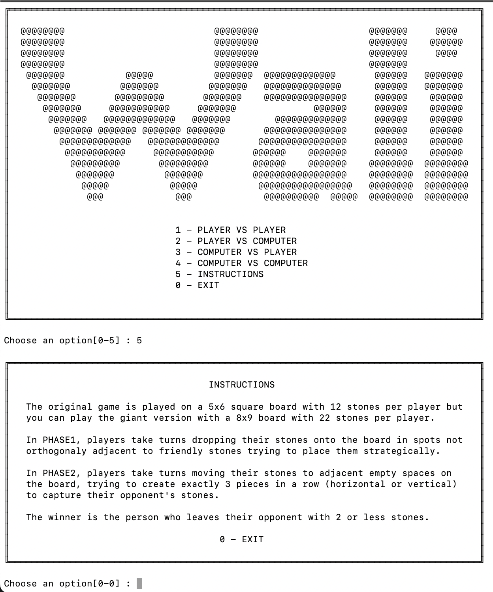
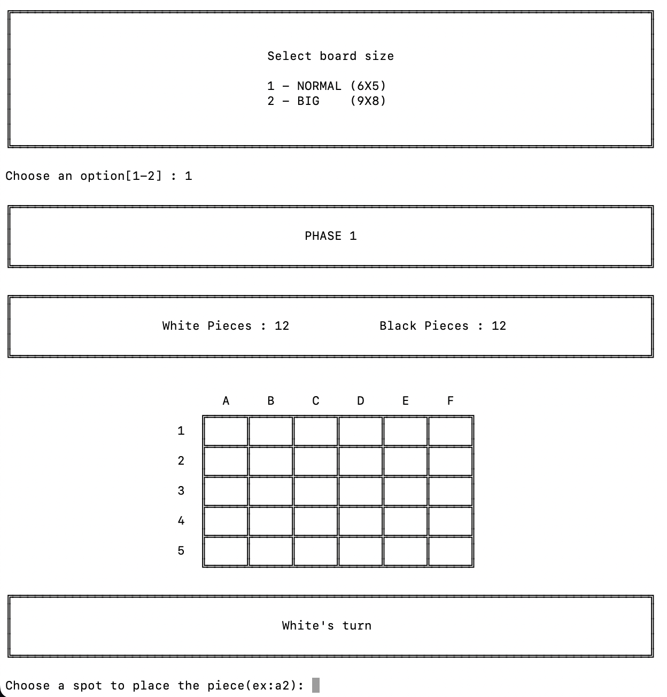
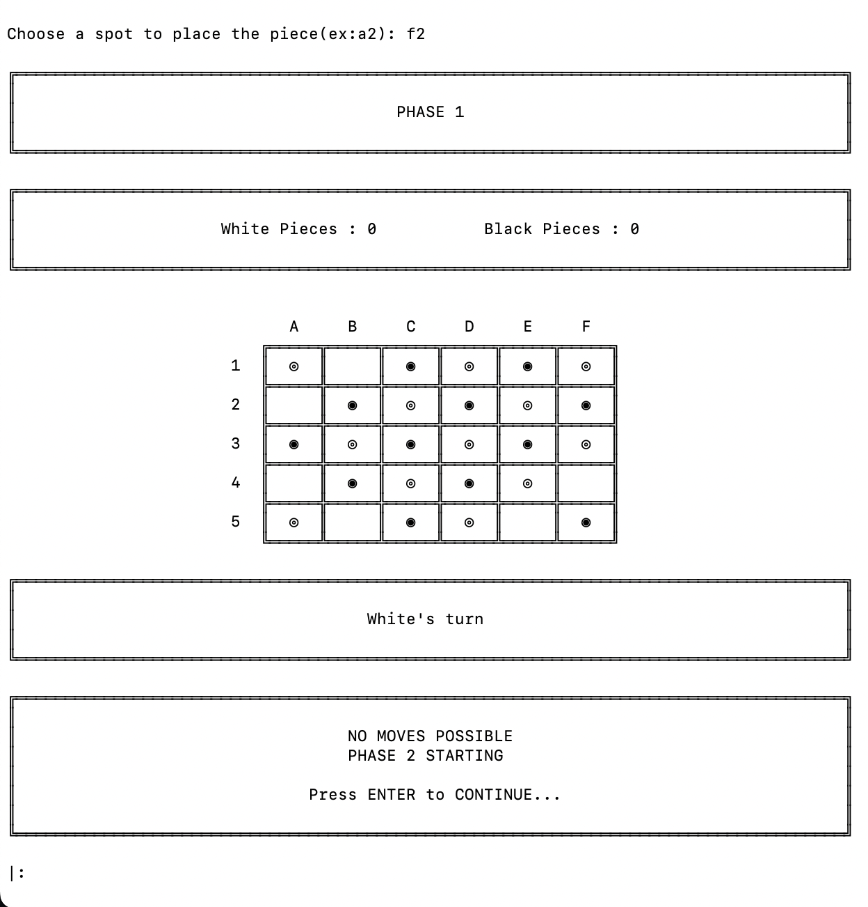
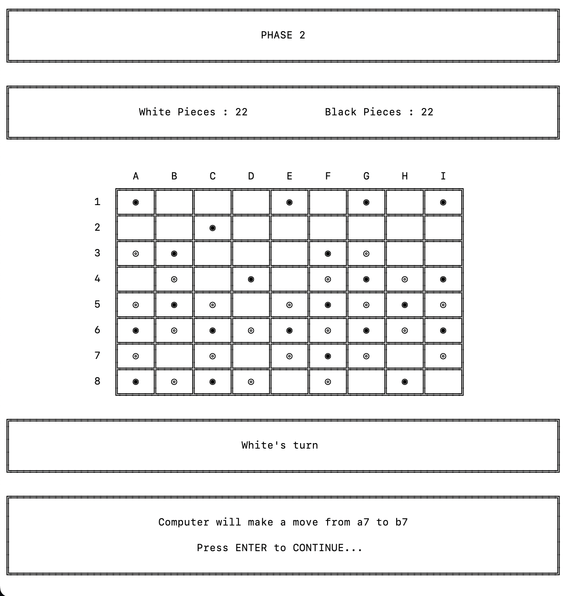
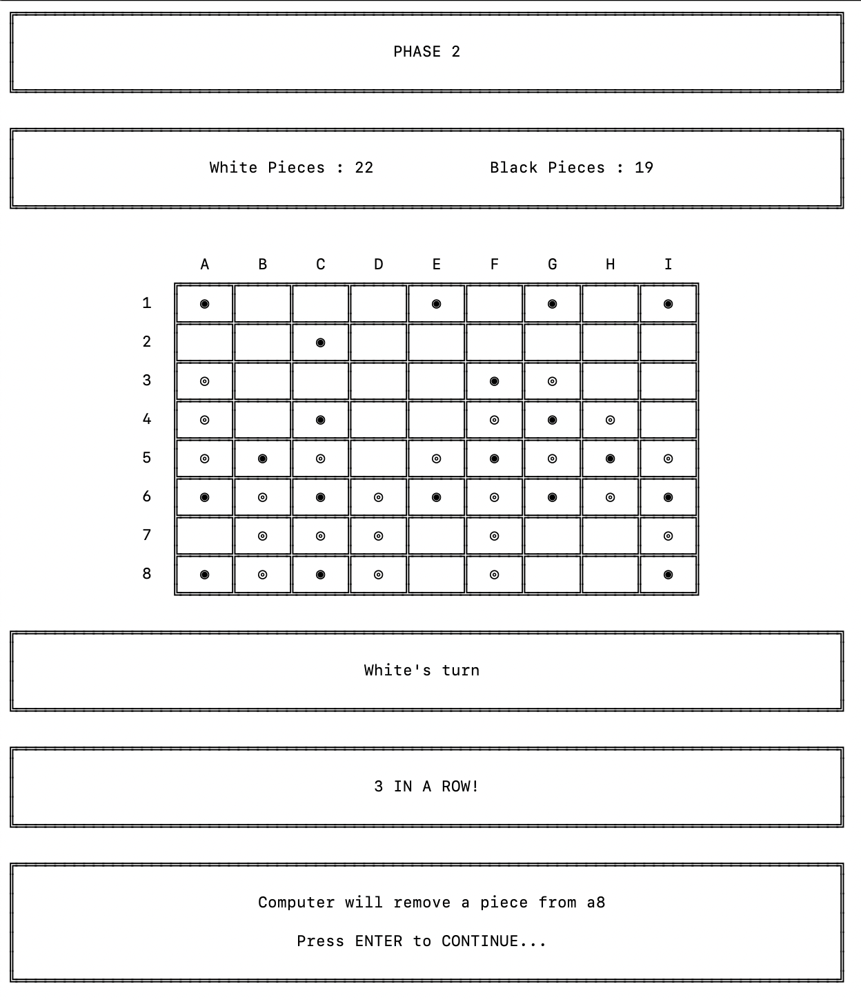
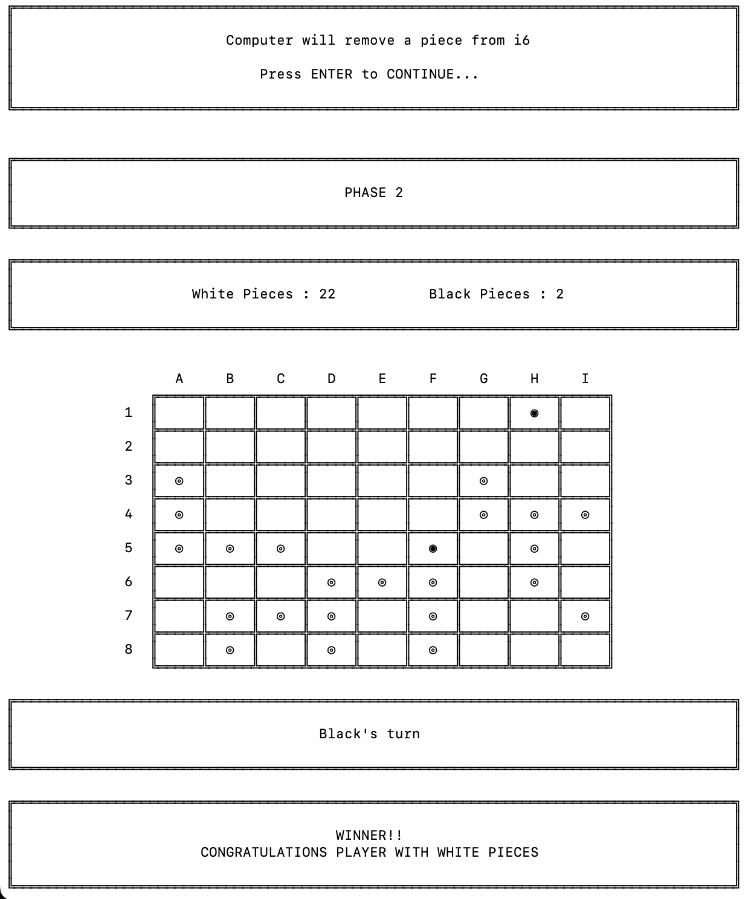
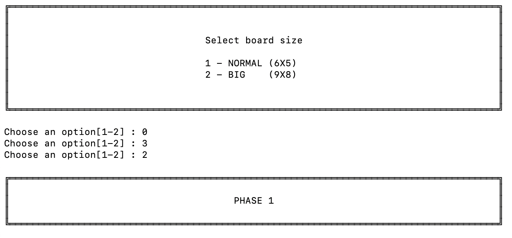
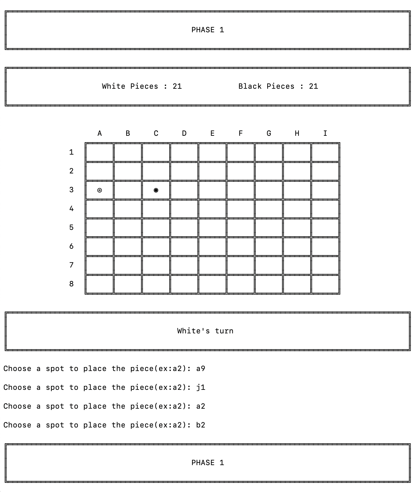
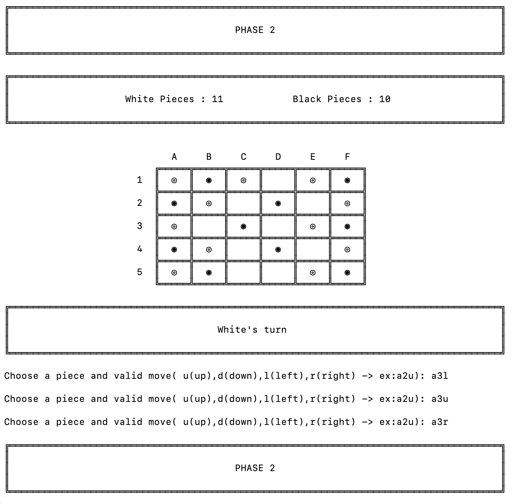
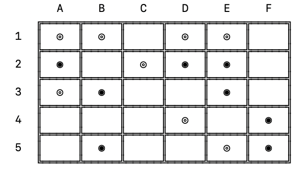

# Wali Board Game

## Wali_1

- Guilherme Cunha Seco Fernandes de Almeida (up202008866) - 50%
- Tiago Filipe Magalhães Barbosa (up202004926) - 50%

## Installation and Execution

### Requisites

- SICStus Prolog 4.7.1

### Execution

- Go into the /src folder
- Open SICStus Prolog in command line or in the console;
- Run `compile('wali.pl').` to compile the game app or in console File -> Compile -> wali.pl;
- Run `play.` to start the game.

## Description of Wali

- Traditional 2-player game from West Africa
- Played on a 5x6 rectangular board or a 8x9 big special board
- Each player has 12 game pieces in his own color or 22 game pieces in case of special big board
- Players initially take turns placing pieces on the board
- On each turn, players take turns dropping one of their stones from the reserve onto an empty space on the board
- The stone must be placed on a space that is not adjacent to any of the player's own stones
- If a player cannot make a legal drop, they must pass their turn
- This continues until all stones have been placed on the board, or until no more stones can be legally dropped.
- After all pieces are placed, players take turns moving their own pieces to empty adjacent spaces on the board
- If a player forms an exact vertical or horizontal 3 in a row with his pieces, he may capture one enemy piece
- The player who captures all enemy pieces until there are only 2 left, leaving the opponent with no chance to make 3 in row, wins the game.

You can check more in:

- [Wali](https://www.di.fc.ul.pt/~jpn/gv/wali.htm)
- [BoardGameGeek](https://boardgamegeek.com/boardgame/66351/wali)
- [Wikipedia](https://en.wikipedia.org/wiki/Wali_(game))

## Game logic

### Start of the game

The `play/0` predicate, which is in charge of displaying the start menu and launching `play_game/6` in accordance with the selected game choice and board size, initializes the game. The choices Human vs Human, Human vs Computer, Computer vs Human, Computer vs Computer , Instructions and Exit are the viable options. If a game option is selected the `game_cycle/7` predicate is called to start the game loop. The user is prompted to select the difficulty level if a computer-based game mode is selected. Input verification is done for both the game mode , the board size and the AI level selections, and if either is incorrect, the user is prompted to enter their selection again.

### Internal representation of the state of the game

To represent our game we need a way to represent the board , the number of pieces for each player, the current turn and the current phase.

- The 5x6 or 8x9 board is represented as 2d list with numbers where 0 represents empty cell, 1 represents white pieces and 2 represents black pieces.

- The number of pieces for each player is represented with a simple number. In phase 1 this number represents the number of pieces in the reserve and in phase 2 represents the number of pieces on the board.

- The current turn is represented with `whiteturn` or `blackturn`

- The current phase is represented with the number 1 or 2 indicating drop or move phase respectively

#### Examples

- Initial game state

<div style="display: block;  width: 50%; text-align: left">

```prolog
board :[[0,0,0,0,0,0],  WhitePieces: 12
        [0,0,0,0,0,0],  BlackPieces: 12
        [0,0,0,0,0,0],  Turn: whiteturn
        [0,0,0,0,0,0],  Phase: 1
        [0,0,0,0,0,0]]  
```

</div>

- Intermediate phase 1 game state

<div style="display: block;  width: 50%; text-align: left">

```prolog
board :[[1,0,1,0,2,0],  WhitePieces: 5
        [0,1,0,1,0,0],  BlackPieces: 6
        [2,0,2,0,2,0],  Turn: blackturn
        [0,2,0,1,0,2],  Phase: 1
        [0,0,1,0,1,0]]  
```

</div>

- Intermediate phase 2 game state

<div style="display: block;  width: 50%; text-align: left">

```prolog
board :[[1,0,1,0,2,0],  WhitePieces: 4
        [0,1,0,1,0,0],  BlackPieces: 7
        [2,2,2,0,2,0],  Turn: blackturn
        [0,0,0,0,0,2],  Phase: 2
        [0,0,2,0,0,0]]  
```

</div>

- Final game state

<div style="display: block;  width: 50%; text-align: left">

```prolog
board :[[1,0,1,0,0,0],  WhitePieces: 2
        [0,0,0,0,0,0],  BlackPieces: 5
        [2,2,2,0,2,0],  Turn: blackturn
        [0,0,0,0,0,2],  Phase: 2
        [0,0,0,0,0,0]]  

Winner: Black
```

</div>

### Game state view

The visualization of the game is all implemented in the `output.pl` module.

To display all the banners with text in our program we use the `draw_menu/2` predicate that draws the borders and the items of the banner. With this predicate we developed the following predicates:

- `display_start_menu`
- `display_select_board_menu`
- `display_select_difficulty_menu/1`
- `display_instructions`
- `display_phase/1`
- `display_nr_pieces/2`
- `display_turn/1`
- `display_3_in_a_row`
- `congratulate_winner/1`
- `press_any_key_to_continue/1`

All this predicates are used to display information to the user in an aesthetically pleasing manner.

We also created a `display_board/1` predicate that given a 2d list representing the board displays it with special box drawing unicode characters.

With all this predicates defined we can use the `display_game/5` predicate that displays the current game state using the above explained predicates.

#### Examples

- Start menu and instructions

<p align="center">
  
</p>

- Start game

<p align="center">
  
</p>

- End Phase1

<p align="center">
  
</p>

- Phase2

<p align="center">
  
</p>

- Phase2 3 in a row

<p align="center">
  
</p>

- End of game

<p align="center">
  
</p>

To deal with user input we created the `input.pl` module where we have all the predicates to receive and validate the input for option in the menu and moves in game.

To validate menu options we use `read_until_between/3` that asks the user for a number continuously until it is between 2 numbers.

To validate input for the moves we use the `read_move/3` and `read_move/4` predicate to read a string from the user and parse it to a move with `parse_move/3` and `parse_move/5` to transform the move into X and Y positions of the board. If the X and Y are not valid the process is repeated until a valid input is given.

#### Examples

- Menu options

<p align="center">
  
</p>

- Move in phase1 (a9 and j1 are not possible places on the board and a2 is not valid because it is neighbor of an existing friendly piece)

<p align="center">
  
</p>

- Move in phase2 (a3l and a3u are not valid moves)

<p align="center">
  
</p>

### Moves Execution

To obtain the move from the user as we above explained we use the `parse_move/3` and `parse_move/5` to transform inputs with the format < letter >< number > into and X and Y position and inputs < letter >< number >< [u-d-l-r] > into X, Y, NewX and NewY (Ex: a2 -> X=0 ; Y=1 and b3d -> X=1 ; Y=2 ;NewX=1 ; Y=3 ). If the above formats are not respected then the predicate fails.

If the predicate succeeds , then we call `validate_place_piece/4`, `validate_remove_piece/4` or `validate_move_piece/6` depending on the type of move. This predicates will see if the X and Y positions are inside the board and verify if the move respects the game rules by using predicates like `not_occupied/3` and `no_neighbours/4` for placing pieces, `has_enemy/4` for removing pieces and `has_piece/4` and `not_occupied/3` for moving pieces.

If the above predicates succeed then the move is valid and we can call `place_piece/5` , `remove_piece/5` or `move_piece/7` depending on the type of move. This predicate will take the current board and the parsed move in the form of X and Y positions and return a new board after the move.

[Note: We did not follow the conventional `move` name because our game has various type of moves and by adopting different names we improved the code readability]

After the move if the move is a `place_piece` move we need to verify with `go_to_phase2/4` if there are no more valid moves and therefore move to phase 2 or with `pass_place_piece/4` if there are still valid moves but not for the current player so he must pass.

If the move is a `move_piece` move, after the move we need to verify if a new 3 in a row was made with `new_3_in_a_row/10` that will use `check_board_for_3_in_a_row/3` to verify the 3's in a row in the board before the move and after the move and compare those 3's in a row to see if a new one was made and therefore ask the user to remove an enemy piece.

### List of Valid Moves

To obtain a list of the valid moves in any point of the game we use the predicates `valid_place_piece_moves/3`, `valid_remove_piece_moves/3` or `valid_move_piece_moves/3` depending on the type of move.

These predicates use the findall predicate to find all the moves that are valid.

<div style="display: block;  width: 60%; text-align: left">

```prolog

findall(X-Y, validate_place_piece(Board,X,Y,Turn), Moves).
findall(X-Y, validate_remove_piece(Board,X,Y,Turn), Moves).
findall(X-Y, validate_move_piece(Board,X,Y,Turn), Moves).

```

</div>

Then the Moves list will have the moves on the form of X-Y or X-Y-NewX-NewY.

### End of Game

To verify the end of the game we call `game_over/4` that justs verify if any of the player has 2 or less pieces and returns the winner of the game.

### Board Evaluation

To evaluate a specific game state we use `value/4` or `value/5` depending if it the value for placing or removing pieces or the value for moving a piece (this value needs the previous board to be given so it can see if a new 3 in a row was made).

The predicate to get the value of a board for placing pieces simply gives a score to the board based on the number of diagonally connected pieces it has. This is because on the drop phase (phase 1) if we put our pieces diagonally with each other we can make various 3 in a row in phase 2 and therefore win more easily.

The predicate to get the value of a board for moving pieces gives a score to the game state by analyzing if a new 3 in a row was made. If no 3 in a row was made the value will be -1 and if a new 3 in a row was achieved the value will be positive and equal to the number of new 3's in a row made.

The predicate to get the value of a board for removing pieces was the most complex one because in our game this phase is very important because you can prevent 3's in a row from your opponent by removing crucial pieces. Therefore this predicate gives the game state a value corresponding to the negative value of the opponent best move in the next move. Therefore the better the opponent best move in the next turn, the worse that game state is for us. This will make us better value moves that remove pieces that in the next turn would allow the opponent to make a 3 in a row. This predicate is therefore the only one that looks into the future and assumes that the opponent will play the best possible move. To better visualize:

<p align="center">
  
</p>

In this case it is white to move. White may move b1 to c1, making a 3 in-a-row(c1-d1-e1) and remove the black stone at e3 or f4 removing 2 possible 3 in a rows with the move e3 to f3 or f4 to e4.
With our algorithm the removal of e3 or f4 will have the best value (1) because after it's remove the opponent won't have any 3 in a rows to make so the board will have a value of -1. Because we value the board by the number of new 3's in a row possible, removing e3 or f4 will be better than e2 or f5 because this moves only prevent one 3 in a row and therefore still leave the opponent chance to make a 3 in a row. Still e2 or f5 will be better moves than others that don't remove any 3 in a row.

### Computer move

We implemented 3 leves of AI in our game representing easy, medium and hard difficulties.

To choose a computer move we use `choose_place_piece/6`, `choose_move_piece/8` or `choose_remove_piece/6` depending on type of move. This predicates use `human_turn/3`, `computer1_turn/3`, `computer2_turn/3` and `computer3_turn/3` to verify what player is going to play. If it a computer of level 1 it gets all the possible moves and returns a random move. If it is a computer of level 2 or 3 , it gets all the possible moves then calculates the value for each move with the predicate setof and then calls `get_best_place_piece/5`, `get_best_move_piece/7` or `get_best_remove_piece/5`. These predicates if it is a level 2 AI select the 3 best moves and then it chooses a random move from this. If it is a level 3 AI it will always play the best move so it gets only the moves with the best value and then selects one. The difference between level 2 and level 3 AI is that level 2 when selecting the top 3 moves there can be moves with different value so it is not guaranteed that the best move will be played while with level 3 it is guaranteed that the move played will have the highest value possible. In any level 2 or level 3 if all the moves have the same value instead of selecting only 3 or 1 we do like in AI level 1 and select a random move because we know that no move is better than other giving the computer a more random behaviour when there is no clear good move.

## Conclusions

In conclusion, it was a little difficult to comprehend Prolog's syntax at first when working on this project. But as we went along and created our first few predicates, we discovered that working with Prolog become lot simpler. Overall, we felt that we cemented the information we had learned in our studies and had a great time working on this project. We appreciated being able to use Prolog to make an entertaining game, and working on this project allowed us to put what we had learned into practice in a meaningful and enjoyable way. We are appreciative of the chance to work on this project despite the early challenges, and we have faith in our capacity to keep learning and developing as Prolog programmers.
In our program that thing that we feel can be improved is that when a clear winning move is not available the computer will play random because all moves will have the same value. For example if a new 3 in a row is not possible the computer plays random. This could be improved by changing our algorithm to value moves that move pieces that in 2 moves will make a 3 in row. This would require seeing a lot into the future and a lot of processing power but we think we could implement something like chess game engines that analyze the game with a lot of depth to discover the best moves.

## Bibliography

- [Wali](https://www.di.fc.ul.pt/~jpn/gv/wali.htm)
- [BoardGameGeek](https://boardgamegeek.com/boardgame/66351/wali)
- [Wikipedia](https://en.wikipedia.org/wiki/Wali_(game))
- [Moodle](https://moodle.up.pt/course/view.php?id=1997)
- [Sicstus](https://sicstus.sics.se/sicstus/docs/latest4/html/sicstus.html/)
